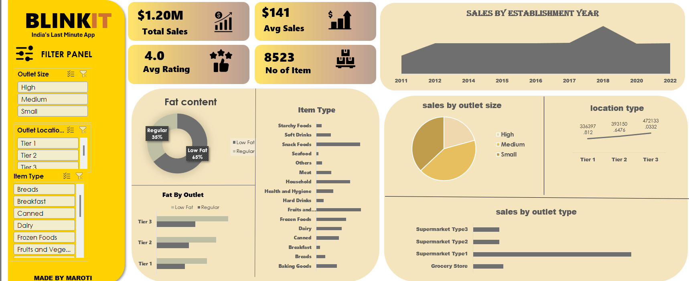

# Blinkit Sales Analysis Dashboard (Power BI)

## 📊 Project Overview
This project presents a **Power BI dashboard analyzing Blinkit sales data**.  
The dashboard provides insights into **sales performance, product categories, outlet types, and customer ratings**.

The goal of this project is to demonstrate **data analysis, visualization, and business intelligence skills using Power BI**.

---

## 🧰 Tools & Technologies
- Power BI
- Excel (Dataset)
- Data Cleaning
- Data Modeling
- DAX
- Data Visualization

---

## 📈 Dashboard Features

### Key Performance Indicators (KPIs)
- **Total Sales:** $1.20M  
- **Average Sales:** $141  
- **Average Rating:** 4.0  
- **Number of Items:** 8523  

---

### Sales by Establishment Year
This chart shows the **trend of sales across different outlet establishment years**, helping understand how outlet age impacts revenue.

---

### Fat Content Analysis
A donut chart showing the distribution between:
- **Low Fat Products (65%)**
- **Regular Products (35%)**

This helps analyze customer product preferences.

---

### Item Type Analysis
Sales distribution across different product categories such as:
- Fruits & Vegetables
- Snack Foods
- Household
- Frozen Foods
- Dairy
- Seafood
- Hard Drinks
- Breakfast
- Baking Goods

---

### Sales by Outlet Size
Comparison of sales performance by outlet size:
- High
- Medium
- Small

---

### Location Tier Analysis
Sales comparison across different city tiers:
- Tier 1
- Tier 2
- Tier 3

---

### Sales by Outlet Type
Comparison of revenue from:
- Grocery Store
- Supermarket Type1
- Supermarket Type2
- Supermarket Type3

---

## 📊 Key Insights
- **Tier 3 locations generate the highest sales**
- **Low Fat products dominate overall sales**
- **Supermarket Type1 outlets contribute the most revenue**
- **Snack Foods and Fruits & Vegetables are top performing categories**

---

## 📂 Project Structure
```
Blinkit-Sales-Dashboard
│
├── dataset
│   └── blinkit dataset
├── dashboard
│   └── blinkit_dashboard.pbix
│
├── images
│   └── dashboard_preview.png
│
└── README.md
```

---

## 📷 Dashboard Preview


---

## 🚀 How to Use
1. Download the `.pbix` file
2. Open it using **Power BI Desktop**
3. Explore the dashboard and apply filters to analyze insights

---

## 💡 Skills Demonstrated
- Data Analysis
- Business Intelligence
- Dashboard Development
- Data Visualization
- Analytical Thinking

---

## 👨‍💻 Author
**Maroti Biradar**

Aspiring **Data Analyst | Excel | Power BI | SQL | Python**

---

⭐ If you like this project, please **star the repository**!
